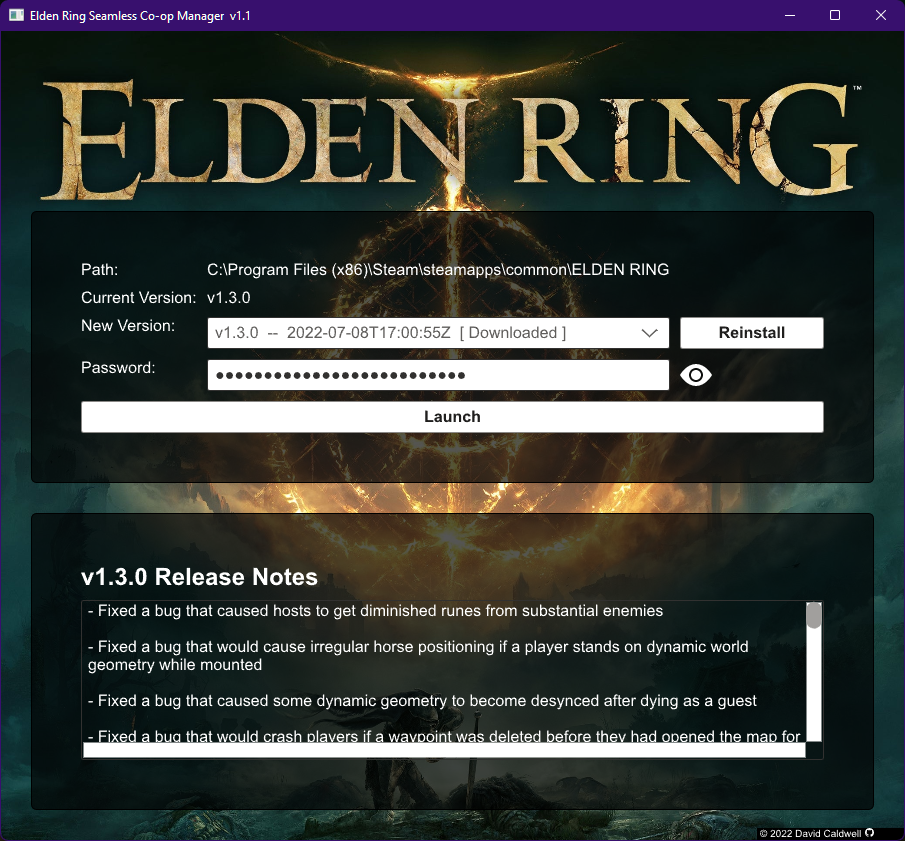

Elden Ring Seamless CoOp Manager
================================

This gives a nice (IMHO) GUI to download and install [The Elden Ring
Seamless Coop Mod][1].

It should auto-detect your Elden Ring install directory, pull down the
current list of mod versions available on the [Github releases page][2], and
let you install one (without overwriting your `cooppassword.ini` file).

[Get the latest release here][3].

Screenshot
----------

[1]: https://github.com/LukeYui/EldenRingSeamlessCoopRelease
[2]: https://github.com/LukeYui/EldenRingSeamlessCoopRelease/releases
[3]: https://github.com/caldwell/erscom/releases/latest

License
-------

Copyright © 2022 David Caldwell <david_erscom@porkrind.org>

**TLDR**: [gplv3](LICENSE.md). You can redistribute the .exe (or a modified
version) as long as you ship the source code used to build it alongside.

This program is free software: you can redistribute it and/or modify
it under the terms of the GNU General Public License as published by
the Free Software Foundation, either version 3 of the License, or
(at your option) any later version.

This program is distributed in the hope that it will be useful,
but WITHOUT ANY WARRANTY; without even the implied warranty of
MERCHANTABILITY or FITNESS FOR A PARTICULAR PURPOSE.  See the
GNU General Public License for more details.

You should have received a copy of the GNU General Public License
along with this program.  If not, see <https://www.gnu.org/licenses/>.
