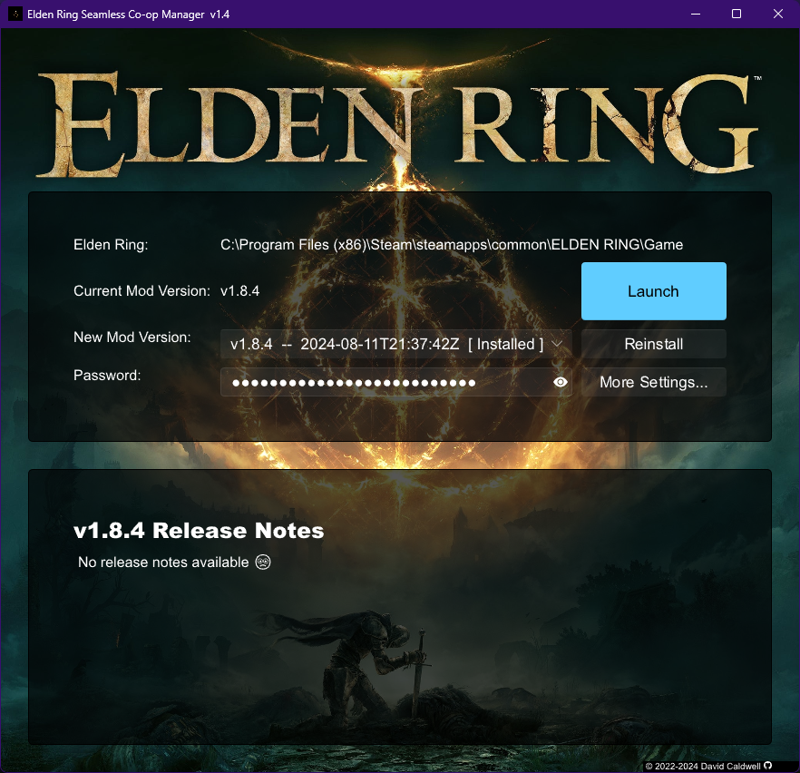

Elden Ring Seamless CoOp Manager
================================

This gives a nice (IMHO) GUI to download and install [The Elden Ring
Seamless Coop Mod][1].

It should auto-detect your Elden Ring install directory, pull down the
current list of mod versions available on the [Github releases page][2], and
let you install one (without overwriting your `cooppassword.ini` file).

[Get the latest release here][3].

Screenshot
----------

[1]: https://github.com/LukeYui/EldenRingSeamlessCoopRelease
[2]: https://github.com/LukeYui/EldenRingSeamlessCoopRelease/releases
[3]: https://github.com/caldwell/erscom/releases/latest
